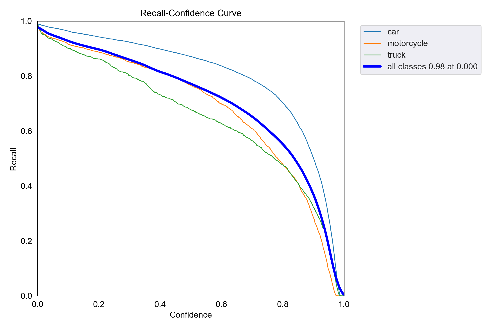
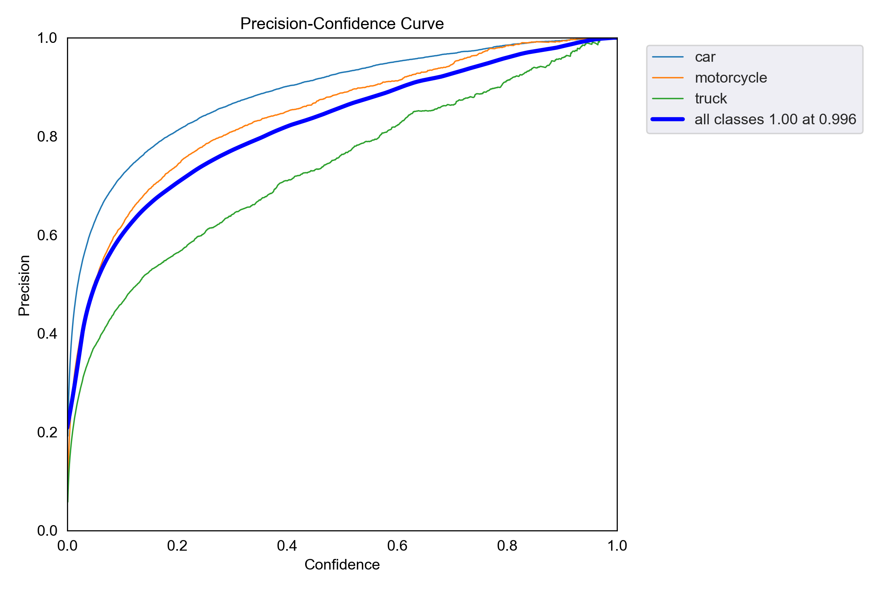
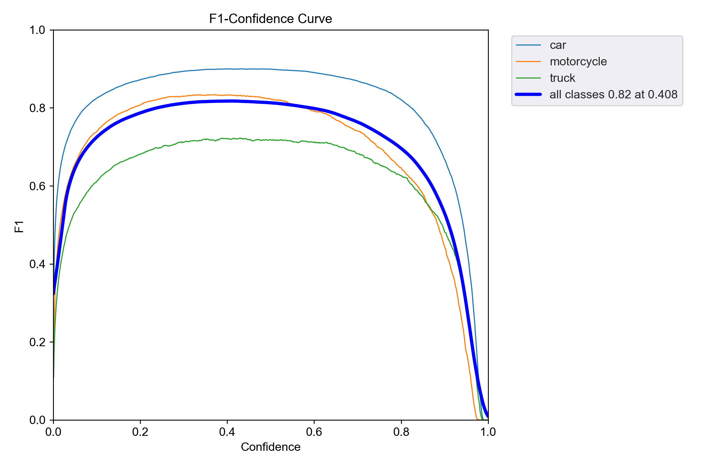
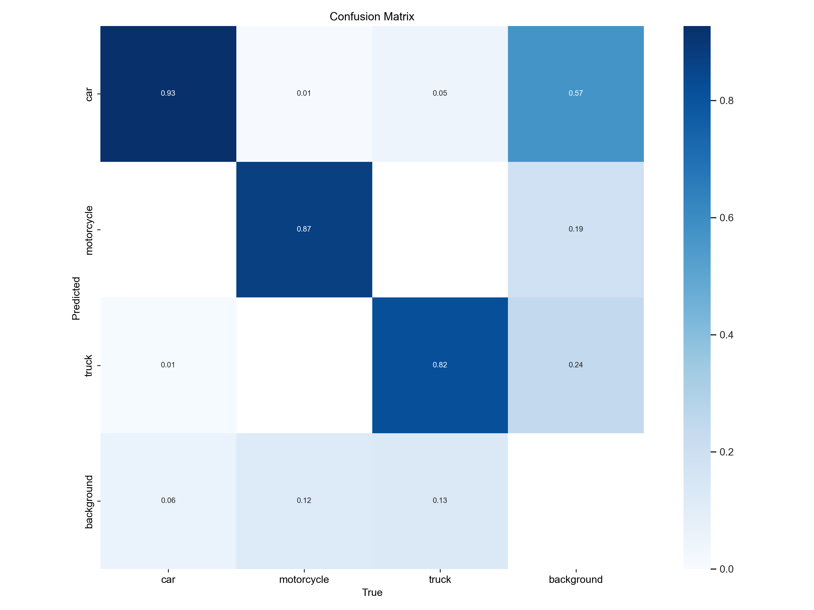
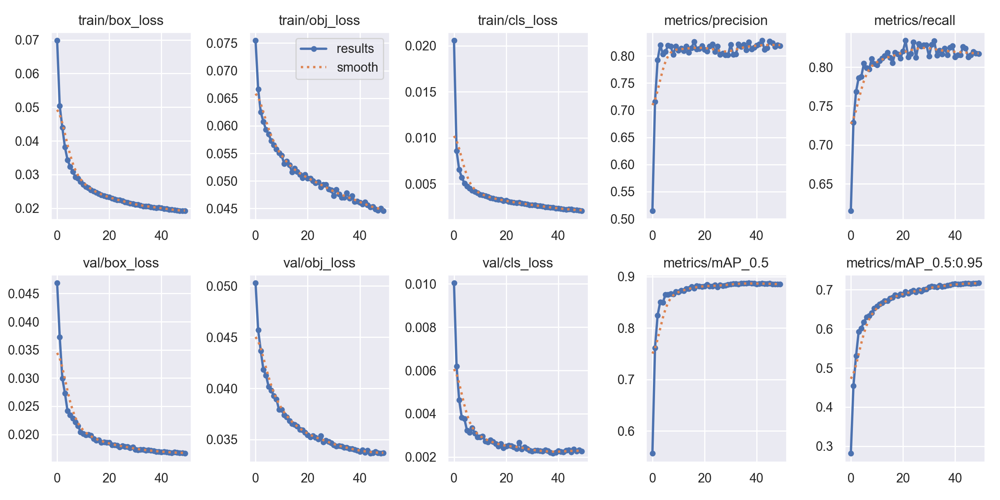

# YOLOv5 Traffic Jam Detection 🚦

## Introduction📖

This is a project on the YOLOv5-based traffic congestion detection system using object detection on images, videos, and real-time cameras. It involves the detection of vehicles from the images and identification of the traffic congestion based on their speed and density.🚀

## Motivation 🌟
Among several issues in urban centers, traffic congestion massively affects travel time and fuel consumption. If the traffic jam is detected efficiently and in real-time, it can help in effective traffic management and route planning. In this project, a robust system for detecting traffic jams is developed using the deep learning model YOLOv5.🚗🚙🚚

## Data Source📊
It uses a dataset of different images and videos of the traffic scenario to train the YOLOv5 model. Further, more annotations regarding the vehicle's position and class were prepared manually to improve this model's performance.

The link to download dataset for training Yolov5: 
- https://universe.roboflow.com/v9/car-models-ismtj/browse?queryText=&pageSize=50&startingIndex=0&browseQuery=true

## File Descriptions 📄
- `modified_detect.py`: Script for running the YOLOv5 detection inference.
- `train.py`: Script for training the YOLOv5 model on the custom dataset.
- `utils/`: Directory containing utility scripts for data loading, plotting, and other functions.
- `data/`: Directory containing the dataset and annotations.
- `models/`: Directory containing the YOLOv5 model definitions and configurations.

## How to Use the Code 🤔
#### Usage 🔧

1. Clone the Repository:

  - git clone https://github.com/yourusername/yolov5-traffic-jam-detection.git  
  - cd yolov5-traffic-jam-detection

2. Install Requirements::

  - pip install -r requirements.txt

3. Run Detection on an Image:

  - python modified_detect.py --weights runs/train/exp/weights/best.pt --source data/images/your_image.jpg

4. Run Detection on a Video:

  - python modified_detect.py --weights runs/train/exp/weights/best.pt --source data/videos/your_video.mp4

5. Run Detection on Live Camera Feed:

  - python modified_detect.py --weights runs/train/exp/weights/best.pt --source 0

## Testing Model 🔍
### Video Predictions

   
  <i>Nornmal Traffic detect demo</i>

   
  <i>Traffic congestion detect demo</i>

  <strong><i>-TensorBoard Training Visualizations after 50 epochs📈-</i></strong>

  
  
   <i>Precision and Recall after training</i>

  
  
  <i>F1 and confusion matrix after training</i>

    
  <i>final result</i>

## Results📝
The YOLOv5 model effectively detects traffic jams by identifying and tracking vehicle speeds and densities. The system alerts when a potential traffic jam is detected based on predefined thresholds for vehicle count and speed.

## Requirements🛠️

To run this project, you will need the following libraries:

| Libraries               |
|------------------------ |
| Pytorch                 |  
| sys                     |  
| platform                |   
| argparse                |  
| csv                     |  
| pathlib                 |  
| numpy                   |  
| os                      |  

 

